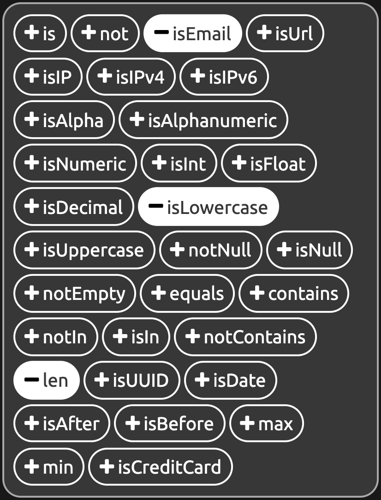
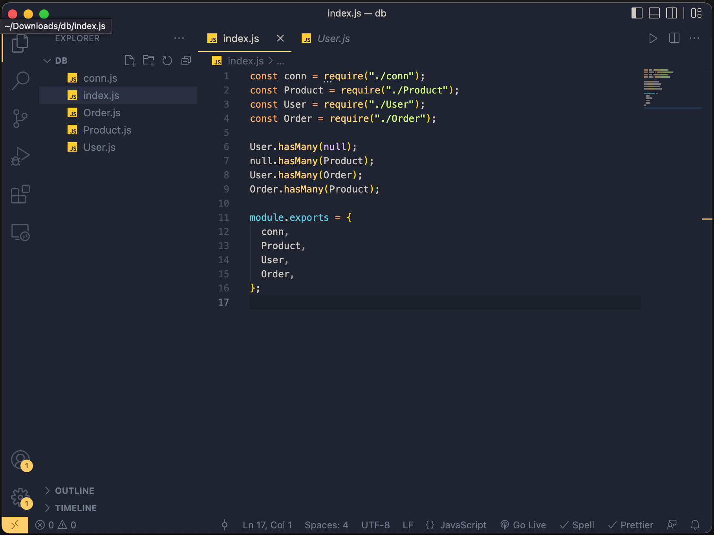
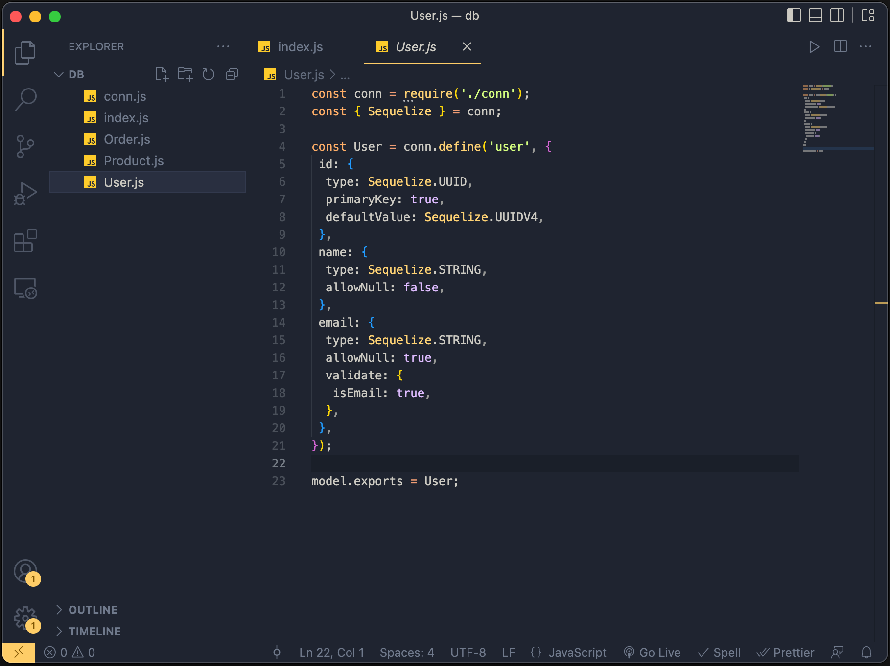

<!-- PROJECT LOGO -->

    
    <h2>Sequirrel - A Sequelize visualizer/generator</h2>
    <a href="https://sequirrel.herokuapp.com/" target="_blank">View Demo</a>
    

<h4>Drag & drop UI to build your sequelize code</h4>

<h4>Support all Sequelize datatypes and 33 types of validations</h4>

<h4>Export the your database as Sequelize code</h4>

